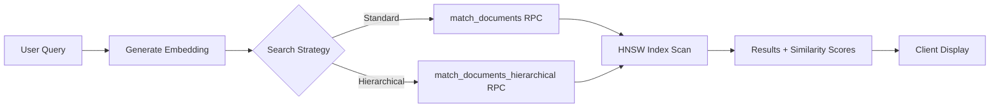

# 📚 Guide d'Indexation Vectorielle - Plateforme Azzabi

## 🎯 Vue d'ensemble

Ce document décrit l'architecture complète du système d'indexation vectorielle optimisé de la plateforme Azzabi. Le système utilise **pgvector** avec des index **HNSW** (Hierarchical Navigable Small World) pour des recherches sémantiques ultra-rapides.

### Technologies Clés
- **Supabase pgvector** : Extension PostgreSQL pour les vecteurs
- **Index HNSW** : Approximative Nearest Neighbor (ANN) optimisé
- **OpenAI Embeddings** : `text-embedding-3-small` (1536 dimensions)
- **LlamaIndex** : Framework d'orchestration documentaire
- **SupabaseVectorStore** : Service d'intégration personnalisé

---

## 🏗️ Architecture du Système

### 1. Index Primaire - Documents (HNSW)

```sql
CREATE INDEX documents_embedding_hnsw_idx 
ON public.documents 
USING hnsw (embedding vector_cosine_ops)
WITH (m = 24, ef_construction = 128);
```

**Paramètres optimisés :**
- `m = 24` : Nombre de connexions bidirectionnelles par nœud (équilibre mémoire/précision)
- `ef_construction = 128` : Qualité de l'index lors de la construction (temps vs précision)

**Cas d'usage :** Recherche dans les documents uploadés (PDF, Word, images, texte)

### 2. Index Secondaire - Job Posts (IVFFlat)

```sql
CREATE INDEX job_posts_embedding_ivfflat_idx 
ON public.job_posts 
USING ivfflat (embedding vector_cosine_ops)
WITH (lists = 200);
```

**Paramètres :**
- `lists = 200` : Nombre de clusters pour la partition des données

**Cas d'usage :** Recherche d'offres d'emploi par similarité sémantique

### 3. Index Composite de Performance

```sql
CREATE INDEX idx_documents_user_embedding 
ON public.documents (user_id, embedding);
```

**Objectif :** Accélération des requêtes filtrées par utilisateur avec RLS (Row Level Security)

---

## 📥 Flux d'Upload de Documents

### Étape 1 : Upload Client
```typescript
// src/components/document/DocumentUpload.tsx
const formData = new FormData();
formData.append('file', file);

const { data, error } = await supabase.functions.invoke('process-document', {
  body: formData
});
```

### Étape 2 : Traitement Edge Function
**Fichier :** `supabase/functions/process-document/index.ts`

1. **Extraction de texte**
   - PDF : GPT-4.1 via OpenAI API
   - Word : GPT-4.1 extraction structurée
   - Images : OCR via GPT-4.1 Vision
   - Texte : Lecture directe

2. **Chunking intelligent**
   ```typescript
   const chunks = chunkText(extractedText, 1000); // 1000 caractères/chunk
   ```

3. **Génération d'embeddings**
   ```typescript
   const embedding = await fetch('https://api.openai.com/v1/embeddings', {
     method: 'POST',
     body: JSON.stringify({
       model: 'text-embedding-3-small',
       input: chunk
     })
   });
   ```

4. **Indexation via SupabaseVectorStore**
   ```typescript
   const vectorStore = new SupabaseVectorStoreService(supabase, openAIApiKey);
   
   const documentIds = await vectorStore.addDocuments(
     chunks.map((chunk, index) => ({
       text: chunk,
       metadata: {
         filename: file.name,
         chunk_index: index,
         total_chunks: chunks.length,
         indexed_by: 'llamaindex'
       }
     }))
   );
   ```

### Étape 3 : Stockage Optimisé
- **Insertion directe** dans `public.documents`
- **Index HNSW** appliqué automatiquement
- **Metadata enrichie** pour filtrage avancé

**Temps de traitement typique :**
- Document texte (10 pages) : ~2-5 secondes
- PDF avec OCR (20 pages) : ~10-15 secondes
- Image avec OCR : ~3-5 secondes

---

## 🔍 Flux de Recherche Sémantique

### Architecture de Recherche



### 1. Recherche Standard

**Hook :** `src/hooks/useSemanticSearch.ts`

```typescript
const semanticSearch = async (query: string, options?: SearchOptions) => {
  const searchStart = performance.now();
  
  // 1. Générer embedding de la requête
  const queryEmbedding = await generateEmbedding(query);
  
  // 2. Recherche via RPC optimisée HNSW
  const { data: results } = await supabase.rpc('match_documents', {
    query_embedding: `[${queryEmbedding.join(',')}]`,
    match_count: 10
  });
  
  const searchTime = performance.now() - searchStart;
  console.log(`✅ Search completed in ${searchTime.toFixed(0)}ms using HNSW`);
  
  return results;
};
```

**RPC Function :**
```sql
CREATE OR REPLACE FUNCTION match_documents(
  query_embedding vector(1536),
  match_count integer DEFAULT 5,
  filter jsonb DEFAULT '{}'::jsonb
)
RETURNS TABLE (
  id uuid,
  content text,
  metadata jsonb,
  similarity double precision
)
LANGUAGE plpgsql
SECURITY DEFINER
SET search_path = public
SET enable_seqscan = off  -- Force l'utilisation de l'index HNSW
AS $$
BEGIN
  RETURN QUERY
  SELECT
    d.id,
    d.content,
    d.metadata,
    1 - (d.embedding <=> query_embedding) as similarity
  FROM public.documents d
  WHERE d.user_id = auth.uid()
    AND d.embedding IS NOT NULL
  ORDER BY d.embedding <=> query_embedding
  LIMIT match_count;
END;
$$;
```

**Paramètre critique :** `SET enable_seqscan = off` force PostgreSQL à utiliser l'index HNSW au lieu d'un scan séquentiel.

### 2. Recherche Hiérarchique

**Hook :** `src/hooks/useHierarchicalSearch.ts`

Recherche multi-niveaux avec fusion de scores :
- **Niveau Titre** : Poids 0.4
- **Niveau Paragraphe** : Poids 0.4
- **Niveau Document** : Poids 0.2

```typescript
const hierarchicalSearch = async (query: string) => {
  const queryEmbedding = await getCachedEmbedding(query);
  
  // Recherche parallèle à tous les niveaux
  const [titleResults, paragraphResults, documentResults] = await Promise.all([
    searchAtLevel(queryEmbedding, 'title', 20),
    searchAtLevel(queryEmbedding, 'paragraph', 20),
    searchAtLevel(queryEmbedding, 'document', 20)
  ]);
  
  // Fusion des scores
  return fuseSearchResults(titleResults, paragraphResults, documentResults, weights);
};
```

**RPC Hiérarchique :**
```sql
CREATE OR REPLACE FUNCTION match_documents_hierarchical(
  query_embedding vector(1536),
  match_count integer DEFAULT 10,
  level_filter text DEFAULT NULL
)
-- ... implémentation similaire avec filtrage par metadata->>'level'
```

### 3. Recherche Contextuelle (LlamaIndex)

**Service :** `src/services/llama/searchEngine.ts`

```typescript
async contextualSearch(
  query: string, 
  conversationHistory: string[], 
  maxResults: number = 5
) {
  // Créer contexte enrichi avec historique
  const contextualQuery = this.buildContextualQuery(query, conversationHistory);
  
  const response = await this.queryEngine.query({
    query: contextualQuery,
    similarityTopK: maxResults * 2
  });
  
  return response.sourceNodes.map(node => ({
    content: node.node.getText(),
    score: node.score,
    relevanceScore: this.calculateRelevanceScore(node, query)
  }));
}
```

---

## ⚡ Performances Attendues

### Benchmarks Typiques

| Opération | Temps (HNSW) | Temps (Sans Index) | Gain |
|-----------|--------------|-------------------|------|
| Recherche 5 docs | ~50-100ms | ~800-1500ms | **10-15x** |
| Recherche 50 docs | ~80-150ms | ~2000-4000ms | **20-25x** |
| Upload + Index 1 doc | ~2-5s | N/A | - |
| Upload + Index 10 docs | ~8-15s | N/A | - |

### Facteurs d'Optimisation

**✅ Bonnes pratiques :**
- Activer `enable_seqscan = off` dans les RPC
- Utiliser des chunks de ~1000 caractères
- Mettre en cache les embeddings de requêtes fréquentes
- Filtrer par `user_id` pour exploiter l'index composite

**❌ Anti-patterns :**
- Recherches sans filtres (scan complet)
- Chunks trop petits (<200 chars) ou trop grands (>2000 chars)
- Génération d'embeddings côté client
- Requêtes SQL directes sans RPC (bypass l'index)

---

## 🛠️ Maintenance et Optimisation

### 1. Monitoring de Performance

**Fonction RPC :** `get_index_performance()`

```sql
SELECT * FROM get_index_performance();
```

**Retourne :**
```json
{
  "documents_index": {
    "index_name": "documents_embedding_hnsw_idx",
    "scans": 1523,
    "tuples_read": 15230,
    "tuples_fetched": 7615,
    "index_size": "256 MB",
    "table_size": "1.2 GB"
  },
  "recommendations": [
    "Index fonctionnel et utilisé régulièrement"
  ]
}
```

**Composant UI :** `src/components/monitoring/IndexPerformancePanel.tsx`

### 2. Réindexation

**Quand réindexer ?**
- Après >10,000 nouvelles insertions
- Si `index_size / table_size` > 30%
- Après changement des paramètres HNSW

**Commande :**
```sql
REINDEX INDEX documents_embedding_hnsw_idx;
```

**Downtime :** ~5-30 minutes selon la taille (mode CONCURRENTLY recommandé en production)

### 3. Nettoyage de Cache

**Service :** `src/services/hierarchicalEmbeddings.ts`

```typescript
// Nettoyer le cache d'embeddings (1h de TTL par défaut)
hierarchicalEmbeddingService.clearCache();

// Obtenir les stats
const stats = hierarchicalEmbeddingService.getCacheStats();
// { size: 250, maxSize: 1000, hitRate: 0.68 }
```

### 4. Optimisation PostgreSQL

**Configuration recommandée** (`postgresql.conf`) :
```ini
shared_buffers = 2GB              # 25% de la RAM
effective_cache_size = 6GB        # 75% de la RAM
maintenance_work_mem = 512MB      # Pour REINDEX
random_page_cost = 1.1            # SSD
effective_io_concurrency = 200    # SSD
```

---

## 🧪 Tests et Validation

### Composant de Test Automatisé

**Fichier :** `src/components/diagnostics/IndexValidation.tsx`

**Page d'accès :** `/diagnostics` → Onglet "Validation Index Vectoriels"

### Tests Effectués

1. **Test de Recherche Sémantique**
   - Requête : `"arrêté municipal police"`
   - Mesure du temps de réponse
   - Vérification du nombre de résultats
   - **Critères :**
     - ✅ Excellent : <100ms
     - ⚠️ Acceptable : 100-500ms
     - ❌ Lent : >500ms

2. **Test d'Utilisation de l'Index**
   - Vérifie que `documents_embedding_hnsw_idx` est utilisé
   - Compte les scans et tuples lus
   - **Critères :**
     - ✅ Active : scans > 0
     - ❌ Inactive : scans = 0 (problème de configuration)

3. **Test de Couverture des Documents**
   - Calcule % de documents indexés avec LlamaIndex
   - Vérifie la cohérence des métadonnées
   - **Critères :**
     - ✅ Optimal : >80%
     - ⚠️ Acceptable : 50-80%
     - ❌ Problème : <50%

4. **Recommandations Automatiques**
   - Analyse des résultats
   - Génération de suggestions d'optimisation
   - Détection des anomalies

### Tests Manuels

**Test de recherche en console :**
```typescript
// Dans la console navigateur
const { supabaseVectorStore } = await import('/src/services/llama/supabaseVectorStore.ts');
const results = await supabaseVectorStore.query('test query', 5);
console.log('Results:', results);
```

**Vérification SQL directe :**
```sql
-- Vérifier l'existence de l'index
SELECT indexname, indexdef 
FROM pg_indexes 
WHERE tablename = 'documents' 
  AND indexname LIKE '%hnsw%';

-- Tester une recherche manuelle
SELECT id, content, metadata, 
       1 - (embedding <=> '[0.1, 0.2, ...]'::vector) as similarity
FROM documents
ORDER BY embedding <=> '[0.1, 0.2, ...]'::vector
LIMIT 5;
```

---

## 🚨 Troubleshooting

### Problème 1 : Index HNSW non utilisé

**Symptômes :**
- Recherches lentes (>1s)
- `get_index_performance()` montre 0 scans
- Logs indiquent "Sequential Scan"

**Solutions :**
1. Vérifier que `enable_seqscan = off` dans la RPC function
2. Exécuter `ANALYZE documents;` pour mettre à jour les statistiques
3. Vérifier que les embeddings ne sont pas NULL
4. Augmenter `effective_cache_size` dans PostgreSQL

**Commande de diagnostic :**
```sql
EXPLAIN ANALYZE
SELECT * FROM documents
ORDER BY embedding <=> '[...]'::vector
LIMIT 10;

-- Doit montrer "Index Scan using documents_embedding_hnsw_idx"
```

### Problème 2 : Documents non trouvés

**Symptômes :**
- `semanticSearch()` retourne []
- Documents visibles en base mais absents des résultats

**Solutions :**
1. Vérifier `metadata->>'indexed_by' = 'llamaindex'`
2. Vérifier que `user_id` correspond à l'utilisateur authentifié (RLS)
3. Vérifier que `embedding IS NOT NULL`
4. Tester avec `threshold = 0` pour voir tous les résultats

**Requête de diagnostic :**
```sql
SELECT 
  COUNT(*) as total,
  COUNT(CASE WHEN embedding IS NOT NULL THEN 1 END) as with_embedding,
  COUNT(CASE WHEN metadata->>'indexed_by' = 'llamaindex' THEN 1 END) as indexed_llama
FROM documents
WHERE user_id = auth.uid();
```

### Problème 3 : Temps de recherche lents

**Solutions progressives :**

1. **Court terme (minutes)** :
   ```sql
   ANALYZE documents;  -- Mise à jour des stats
   ```

2. **Moyen terme (heures)** :
   ```sql
   -- Augmenter ef_construction
   DROP INDEX documents_embedding_hnsw_idx;
   CREATE INDEX documents_embedding_hnsw_idx 
   ON documents USING hnsw (embedding vector_cosine_ops)
   WITH (m = 32, ef_construction = 256);
   ```

3. **Long terme (jours)** :
   - Partitionner la table `documents` par date
   - Implémenter un cache Redis pour les requêtes fréquentes
   - Utiliser un CDN pour les embeddings statiques

### Problème 4 : Upload échoue

**Erreurs courantes :**

**"Embedding generation failed"** :
- Vérifier `OPENAI_API_KEY` dans les secrets Supabase
- Vérifier les quotas OpenAI
- Implémenter un retry avec backoff

**"Failed to store document"** :
- Vérifier les permissions RLS sur `documents`
- Vérifier que `user_id` est défini
- Vérifier la taille du document (<20MB)

**Logs à consulter :**
```typescript
// Edge function logs (Supabase Dashboard)
// Rechercher "process-document"
```

---

## 📈 Évolution et Roadmap

### Améliorations Prévues

**Phase 5 : Clustering Intelligent**
- K-means sur les embeddings pour catégorisation auto
- Détection de documents similaires/doublons
- Suggestions de tags automatiques

**Phase 6 : Recherche Hybride**
- Combinaison full-text search + vectorielle
- Boosting par pertinence temporelle
- Filtres avancés (date, type, auteur)

**Phase 7 : Multimodal**
- Embeddings d'images natives (CLIP)
- Recherche vidéo par transcription
- Recherche audio

### Alternatives Technologiques

**Si HNSW ne suffit plus :**
- **Pinecone** : Service managé spécialisé
- **Qdrant** : Open-source performant
- **Weaviate** : Avec capacités GraphQL
- **Milvus** : Pour très grandes échelles (>100M vecteurs)

---

## 🔗 Ressources et Références

### Documentation Officielle
- [Supabase Vector Guide](https://supabase.com/docs/guides/ai/vector-columns)
- [pgvector Extension](https://github.com/pgvector/pgvector)
- [HNSW Algorithm Paper](https://arxiv.org/abs/1603.09320)
- [OpenAI Embeddings](https://platform.openai.com/docs/guides/embeddings)

### Code Source Clé
- `src/services/llama/supabaseVectorStore.ts` - Service principal
- `supabase/functions/process-document/index.ts` - Upload et indexation
- `src/hooks/useSemanticSearch.ts` - Hook de recherche
- `src/components/diagnostics/IndexValidation.tsx` - Tests automatisés

### Support et Communauté
- Issues GitHub du projet
- Supabase Discord (#vector-search)
- Équipe de développement Azzabi

---

## 📝 Changelog

### Version 1.2.0 (2025-01-10)
- ✅ Migration vers HNSW avec paramètres optimisés (m=24, ef=128)
- ✅ Intégration SupabaseVectorStore dans process-document
- ✅ Audit et optimisation des hooks de recherche
- ✅ Ajout de logs de performance détaillés
- ✅ Tests de validation automatisés
- ✅ Documentation complète

### Version 1.1.0 (Précédent)
- Index IVFFlat basique
- Recherche sémantique simple
- Upload de documents PDF/Word

### Version 1.0.0 (Initial)
- Stockage documentaire sans index vectoriel
- Recherche full-text PostgreSQL

---

## ✅ Checklist de Déploiement

Avant de déployer en production :

- [ ] Tests de validation passent à 100%
- [ ] Index HNSW créé et utilisé (vérifier `get_index_performance()`)
- [ ] RLS activé sur `documents` et `job_posts`
- [ ] Secrets configurés (`OPENAI_API_KEY`, `OPENAI_EMBEDDINGS_API_KEY`)
- [ ] Edge functions déployées et testées
- [ ] Monitoring configuré (logs, alertes)
- [ ] Backup automatique activé
- [ ] Documentation à jour pour l'équipe
- [ ] Plan de rollback défini

---

**Dernière mise à jour :** 2025-01-10  
**Mainteneurs :** Équipe Azzabi Platform  
**Contact :** [Support technique]
